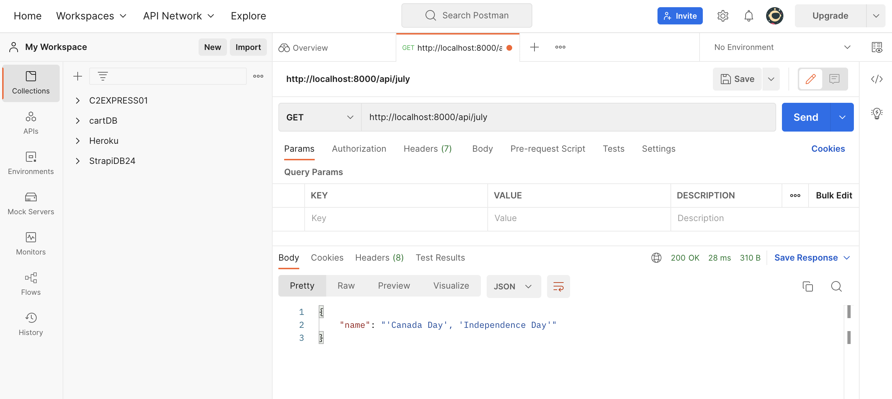

# Holiday_API_Tutorial

A repository intended to show others how to set up a simple server</img>


# Description
This project will help others create a custom API using `Node.js` and `Express.js`. The backend API will be deployed onto Heroku then create a frontend that will consume the API which will be built using HTML and Javascript. The application is simple in nature. It is intended to be a learning tool to teach the process of using Node and Express.


# Installation 
First, check if you have Node installed then open up your terminal and type in: 
```
$ node -v
```
If the terminal responds with a version number, you are set. If not, you will need to install Node. You can install Node by downloading the installer from [Node's Website](https://nodejs.org/en/) or downloading it through package managers like [homebrew](https://zellwk.com/blog/homebrew/) (Mac) and [Chocolatey](https://chocolatey.org/) (Windows).

Now that Node is installed, let's create our project.

## Creating Project Directory

### `mkdir insert-project-name`

To create a folder on your computer, in the terminal, use the following command:
```
$ mkdir insert-project-name
```
 
Please note, that `insert-project-name` can be replaced with your choice of name for the project. Once the directory is made, move it into your project by using the following command in your terminal:
``` 
$ cd insert-project-name
```
You should now see that your terminal is in the correct directory. 

### `npm init`
`npm` is installed with Node, which is why commands like `npm init` and `npm install` are used.
Next, initialize your project which will create a `package.json` file. The terminal will ask a series of questions, hit enter on each question. Keep in mind the `package.json` file can be edited as needed in the future. In the next step, use the command below in your terminal to build your server!
``` 
$ npm init
```

## Creating Server and installing Express.js
### `touch server.js`
Keep practicing using your terminal! Make sure you are still seeing the path to your project that was just created. If not, remember to navigate back into your project directory by using the command listed below in your terminal:
``` 
$ cd insert-project-name
```


Now that you are in the root directory of the project, use the following command in the terminal:
``` 
$ touch server.js
```

`Touch` which will create a file, where as `server.js` will be the name given to the file. Before adding any code to the `server.js` file, install Express.

### `npm install express --save`
`Express` is a framework for building web applications which stacks onto `Node.js`. It simplifies the server creation process that is already available in `Node`. To install `Express`, go back to the terminal and use the following command:
``` 
$ npm install express --save
```
### `npm install cors --save`
To ensure there are not any cors issues in the project, add the cors package as well.
 ``` 
$ npm install cors --save
```
## Building Our Server 
Next, use `Express` in `server.js` file by requiring it at the top of the file.
```
const express = require('express');
const app = express();
```
Copy the code from the `server.js` file in this repository. The code within the file, will be broken down below: <br/>
On line 9 of the `server.js` file, it holds the API data for holidays. This data can be replaced with whatever API you want to build. This tutorial is only going to focus on creating a server that will "Read" using the `Get` method. Keep in mind, there are three other common methods that will not be covered to complete a CRUD app.

In `Express`, we handle a "Read" request with the `Get` method:
```
app.get(endpoint, callback)
```
The endpoint is the requested endpoint. In this case we want the server to send the `index.html` file to the client's side.  Our call back function will have two parameters, they are normally abbreviate `request` to `req` and `response` to `res`. The code below will tell the server to show `index.html` to. It is as simple as a few lines of code.

```
app.get('/', (req, res)=>{
    res.sendFile(__dirname + '/index.html')
})
```
Now, to create the `index.html` back to the terminal! First, set up some directories for the purpose of organization. Use the following prompts in the terminal:
``` 
$ mkdir client-side-code
$ cd client-side-code
$ touch index.html
``` 
You will see that a folder named `client-side-code` and a file within it called `index.html` was created. Next, copy the `index.html` file from this repository. It is a simple interface that will consume the API. Now the server has a file to send when it is first called.


## Starting Our Server 

The server does not know what port is being used on your local machine. To fix this issue, create a variable that will define your port. The port number can be anything but standard convention is typically 8000.  

```
const PORT = 8000

app.listen(process.env.PORT || PORT, ()=>{
    console.log(`GO TO PORT ${PORT}`)
})
```
 It's time to run the server using node.

``` 
$ node server.js 
``` 
Head over to [localhost:8000](http://localhost:8000/). You should see the `index.html` page is displayed. To make sure the holiday API is working test it using `Postman`.

Quicktip: restart your server by doing the following:

Any time a change is made in the files, the server will need to be stopped. Stop the current server by hitting `CTRL + C` in the command line. Then run `node server.js` again.


## Postman
Sign up to use [Postman](https://www.postman.com/postman-account/), which will be used to test the holiday API. Once you are in Postman, create a workplace selecting a `Get` request and placing the localhost URL (http://localhost:8000/api/july) into the Postman workplace.  You will see that in the Postman's body response, it will send back the data in our July object located in the holiday API. Let's break down the code that allowed Postman to get this information when we requested this end point.

Postman Workplace</img>

As seen previously when requesting our index.html file: 
```
app.get('/', (res, req)=>{
    //do something
})
```
Let's expand on this structure so that the API is called when requested. In the path request the `:` after the `/` indicates that the following code is the parameter. The rest of the code will grab the month parameter, check it with the holiday API and respond with the information of the object requested. If the paramater does not match anything in the holdiay API, it will respond with the unknown object.  

```
app.get('/api/:month', (req, res)=>{
    const month = req.params.month.toLocaleLowerCase()
    if(holidays[month]){
       res.json(holidays[month])  
    } else  {
        res.json(holidays['unknown'])
    }
   
})
```
## Deploy to Heroku
Now that the API is working, the API will be deployed to Heroku's server. In the `server.js` file you'll see on the `listening function` the following line of code that will allow the server to use the port provided by Heroku:
```
process.env.PORT || PORT
```
## Heroku Procfile
Next, set up a `Procfile` for Heroku to use. Previouly in our terminal, we used the `node server.js` command to start the server. Now Heroku will need instructions to the same command automatically. Make sure you have a [Heroku account](https://signup.heroku.com/)!
Follow the the steps below to create the Procfile and deploy:
```
$ heroku login -i              //you will need to input you user info in step
$ heroku create insert-project-name   
$ echo "web: node server.js" > Procfile //this creates what Heroku needs to start the server
$ git add .
$ git commit -m "creating heroku project"
$ git push heroku main
```
The terminal will give you a link! That's it for the backend. Let's use the API! Go ahead and test the deployed Heroku link in `Postman`. Test the Heroku link. It should work exactly like it did when the server running locally. Simply replace `your-project-name` with your Heroku link.
```
Example of URL to test in Postman:
https://your-project-name.herokuapp.com/api/july
``` 


## Consuming API on client side 
In the terminal, move into the client side folder and create a simple async function to grab the deployed API.

```
$ cd client-side-code
$ mkdir js
$ touch main.js
````
Simply copy and paste the `main.js` code from the repo. Replace the URL in line 6 with your Heroku URL. Do not forget to add `api/${month}` at the end. Now take your `index.html` and run it locally on your machine. In the input, type in a month and you will see a list of holidays corresponding to the month will display! 

That's it, you created your own API using `Node` and `Express` and deployed it to Heroku!

## Support
[MDN Web Docs](https://developer.mozilla.org/en-US/docs/Web/JavaScript)


## Roadmap
Continue to build off this template by completing this CRUD app. 

## License Information
MIT
---

---
